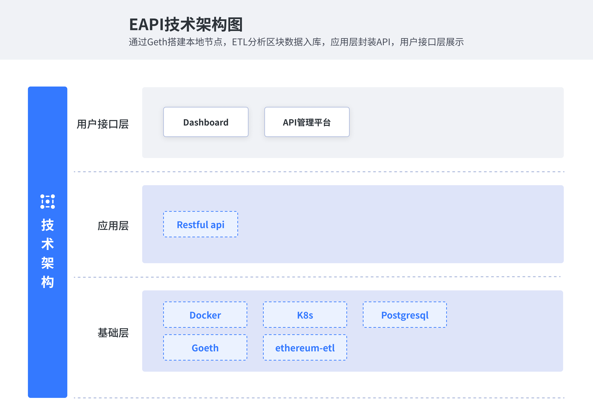

中文 | [English]()
<h1 align="center"> 
    <b>EAPI   
</h1>
<h3 align="center"> 
    通过EAPI可以查询链上数据，实现一个属于自己的infura平台。
<h3>

## 功能
* **NFT查询** - 查询ETH NFT数据

* **智能合约查询** - 查询智能合约数据

* **ERC20查询** - 查询ERC20数据

## 架构

## 如何贡献
申领人可以在issue中申请具有 Bounty 标签的任务，完成贡献，贡献者将可以获取由SeeDAO研发公会提供的SeeDAO SCR积分

## SCR积分是什么
